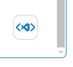
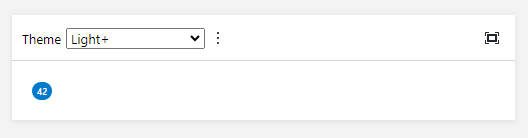

# VSCode Webview Playground

Handy web components to emulate the VSCode Webview environment.

## Installation

Install as npm package:

```
npm install -D @vscode-elements/webview-playground
```

Alternatively, you can just copy the files from the `/dist` directory into your project. 
They are pure JavaScript files, so no bundler is required. It’s up to you how to exclude them from the production build.

## Available components

### &lt;vscode-dev-toolbar&gt;

Insert theme variables and default styles into the page. It appears as a button in the lower right corner. When clicked, a simple toolbar is displayed.



```html
<!DOCTYPE html>
<html>
<head>
  <meta charset="UTF-8">
  <title>Webview Playground</title>
  <script type="module" src="node_modules/@vscode-elements/webview-playground/dist/index.js"></script>
</head>
<body>
  <vscode-dev-toolbar></vscode-dev-toolbar>
</body>
</html>
```

The button can be hidden by the `hidden` attribute or `hidden` property:

```javascript
document.querySelector('vscode-dev-toolbar').hidden = true;
```

### &lt;vscode-demo&gt;

An isolated block intended for use in a documentation site, e.g., Storybook. It inserts the theme variables but doesn't modify the host page's styles.



```html
<!DOCTYPE html>
<html>
<head>
  <meta charset="UTF-8">
  <title>Webview Playground</title>
  <script type="module" src="node_modules/@vscode-elements/webview-playground/dist/index.js"></script>
</head>
<body>
  <vscode-demo>
    <span class="badge activity-bar-counter">42</span>
  </vscode-demo>
</body>
</html>
```

### Internal components

Further "private" components:

- &lt;vscode-theme-selector&gt;
- &lt;vscode-toggle-motion&gt;
- &lt;vscode-toggle-underline&gt;
